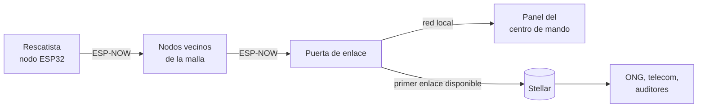
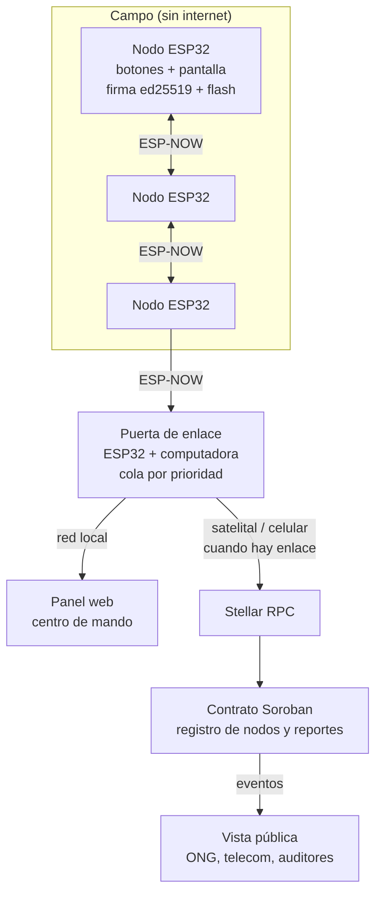

# Product Blueprint

**Nombre del proyecto:** Marvin — Red de reportes de emergencia offline-first

**Repositorio (enlace obligatorio):** [migux97/Marvin](https://github.com/migux97/Marvin)

---

## Contenido

1. Priorización de historias
2. Propuesta de valor
3. Flujo de usuario
4. Alcance del MVP
5. Lean Canvas
6. Backlog priorizado (Kanban)
7. Arquitectura inicial
8. Uso de Stellar y justificación

---

## 1. Priorización de historias

**Criterio de priorización:** reunimos las historias individuales de [Aldo Duran](aldo.md), [Franco Mamani](FrancoMamani.md), [Emanuel Conte](EmanuelConte.md) y [Emanuel Guzman](EmanuelGuzman.md), unimos las repetidas y las clasificamos como **imprescindible** (sin ella el reporte no llega, no es confiable o no se puede usar en la emergencia), **debería** (mejora la adopción o la confianza, pero el MVP funciona sin ella) o **podría** (aporta valor después de la fase crítica). Las de las tres categorías pasan al backlog; el resto queda fuera por ahora.

| Prioridad | Historia | Propuesta por | Por qué entra al backlog |
| :---: | --- | :---: | --- |
| 1 | Como rescatista en campo quiero enviar reportes de estado y ubicación sin internet por la malla de nodos para informar la situación aunque la red celular esté caída. | Aldo Duran | Imprescindible: es el núcleo del producto. |
| 2 | Como rescatista en campo quiero que mi nodo guarde los reportes localmente para no perder datos si la red se cae por completo. | Aldo Duran | Imprescindible: sin offline-first los reportes se pierden. |
| 3 | Como rescatista en campo quiero que mi nodo verifique la firma de cada reporte para descartar reportes falsos o de nodos no registrados. | Emanuel Guzman | Imprescindible: un registro inmutable de datos falsos no sirve. |
| 4 | Como rescatista en campo quiero marcar una zona como revisada y que llegue a las demás brigadas para no duplicar esfuerzos. | Franco Mamani | Imprescindible: ataca el costo más concreto en campo. |
| 5 | Como técnico de la puerta de enlace quiero publicar en Stellar los reportes por prioridad para que lo urgente salga primero aunque el enlace se corte. | Aldo Duran, Emanuel Guzman | Imprescindible: es el punto donde entra la red. |
| 6 | Como responsable de protección de datos quiero que en Stellar solo quede el hash del reporte para cumplir la ley sin perder trazabilidad. | Emanuel Guzman | Imprescindible: sin esto ninguna institución lo adopta. |
| 7 | Como coordinador del centro de mando quiero ver todos los reportes en un solo panel para asignar recursos sin transcribir a mano. | Franco Mamani | Imprescindible: es donde se toman las decisiones. |
| 8 | Como ONG o Cruz Roja quiero consultar el registro en Stellar sin pedir permiso para tener el panorama acumulado. | Franco Mamani, Aldo Duran | Debería: justifica el registro abierto. |
| 9 | Como rescatista quiero corregir un reporte con uno nuevo que anule al anterior para que la información siga siendo confiable. | Franco Mamani | Debería: la inmutabilidad también conserva errores. |
| 10 | Como administrador de la red quiero dar de alta y revocar llaves de nodos para que un nodo robado no pueda publicar. | Emanuel Guzman | Debería: completa el modelo de confianza. |
| 11 | Como brigadista voluntario quiero reportar con plantillas y pocos botones para usarlo bajo estrés sin capacitación. | Emanuel Conte | Debería: clave para la adopción. |
| 12 | Como auditor quiero verificar fecha, firma y hash de cada reporte de recurso entregado para comprobar el uso de la ayuda. | Franco Mamani | Podría: aporta valor después de la emergencia. |
| 13 | Como encargado de un centro de acopio quiero registrar cada entrega con destino y cantidad para evitar desabasto. | Emanuel Conte | Podría: útil, pero no es el problema central. |

**Quedan fuera por ahora:** alertas por sector, estado de batería de los nodos, aviso a hospitales, transparencia para donantes, interoperabilidad con equipos USAR, simulacros con datos reales, consulta para familiares y documentación de la lectura desde Horizon. El bajo costo del kit no es una historia del backlog, sino una restricción de diseño para todo el hardware.

---

## 2. Propuesta de valor

**Usuario (del Problem Brief):** equipos de rescate en campo (bomberos, protección civil, brigadas voluntarias, búsqueda y rescate urbano) y el centro de mando que coordina su trabajo.

**Resultado que obtiene:** durante las primeras 72 horas, cuando la red celular está caída o saturada, cada brigada puede reportar víctimas, colapsos, rutas bloqueadas y zonas revisadas desde un nodo propio, y esos reportes llegan al centro de mando sin relevos de voz ni transcripción manual. Cuando aparece cualquier enlace a internet, los reportes quedan registrados en Stellar con fecha y firma, y cualquier organización puede consultarlos.

**Por qué elegiría esta solución:** cuesta una fracción de una radio profesional, no requiere licencias ni capacitación técnica, funciona sin infraestructura y deja un registro escrito de todo lo reportado. Para el centro de mando significa decidir con información completa, y para la institución significa poder rendir cuentas después.

**En qué se diferencia de cómo lo resuelve hoy:** hoy el reporte depende de tener señal celular o una radio que no deja registro, pasa por varios intermediarios que pueden distorsionarlo y termina en el servidor de una sola institución, que decide qué compartir y que puede caerse. Con Marvin, el reporte viaja de nodo en nodo, se firma en origen, se guarda en cada nodo y se publica en un registro que ninguna institución controla ni puede alterar. No reemplaza a la radio para la comunicación de voz, pero sí a la cadena de transcripción y al servidor central como única fuente de verdad.

---

## 3. Flujo de usuario

| Paso | Rol | Qué hace | Punto de interacción |
| :---: | :---: | --- | --- |
| 1 | Administrador de la red | Antes del despliegue registra la llave pública de cada nodo en el contrato de Marvin. | Panel de administración y Stellar |
| 2 | Rescatista | Encuentra una víctima, un colapso o una ruta bloqueada y elige una plantilla de reporte en su nodo. | Nodo ESP32 (botones y pantalla) |
| 3 | Nodo del rescatista | Firma el reporte, lo guarda en su memoria y lo envía a los nodos cercanos. | Malla ESP-NOW |
| 4 | Nodos intermedios | Verifican la firma, guardan una copia y reenvían el reporte hasta llegar a la puerta de enlace. | Malla ESP-NOW |
| 5 | Coordinador del centro de mando | Ve el reporte en el panel, asigna una brigada y marca prioridades. | Panel web en la red local |
| 6 | Rescatista | Al terminar, marca la zona como revisada; la marca llega a las demás brigadas. | Nodo ESP32 |
| 7 | Puerta de enlace | Cuando hay enlace satelital o celular, publica en lote el hash y la firma de los reportes, primero los de víctimas. | Stellar |
| 8 | ONG, telecom o auditor | Consulta el registro público, sin pedir permiso, y verifica cualquier reporte contra su hash. | Vista pública y Stellar |

---

## 4. Alcance del MVP

| Dentro del MVP (funcionalidad central) | Fuera del MVP (deseable, para después) |
| --- | --- |
| Malla de al menos tres nodos ESP32 con ESP-NOW, reenvío y descarte de duplicados (H1). | Alertas automáticas por sector a jefes de bomberos. |
| Almacenamiento local de reportes en la flash de cada nodo (H2). | Respaldo de largo alcance con LoRa o antenas externas. |
| Firma ed25519 en origen y verificación en cada nodo (H3). | Almacenamiento distribuido del contenido cifrado (por ejemplo, IPFS). |
| Reportes con plantillas: víctima, colapso, ruta bloqueada y zona revisada (H4). | Monitoreo de batería y estado de los nodos. |
| Puerta de enlace con cola por prioridad que publica en Stellar Testnet (H5). | Interoperabilidad con códigos INSARAG para equipos internacionales. |
| Solo hash, llave y firma en Stellar; datos personales cifrados (H6). | Vistas para auditores, donantes y familiares. |
| Panel web del centro de mando en la red local (H7). | Despliegue en Mainnet y gestión de múltiples organizaciones. |

**Por qué el recorte sigue entregando valor:** el MVP cubre el recorrido completo de un reporte, desde que un rescatista lo genera sin señal hasta que queda en un registro público e inalterable, que es exactamente la hipótesis del Problem Brief. Con eso podemos medir lo que más riesgo tiene: el alcance real de ESP-NOW entre obstáculos, si un reporte llega intacto a través de varios saltos y si publicar en Stellar desde un enlace lento es práctico. Lo que queda fuera mejora la adopción o el alcance, pero no cambia si la idea funciona. Las historias "debería" (H8 a H11) entran si el núcleo está listo antes de tiempo, empezando por la vista pública del registro, porque es la que demuestra el valor de no depender de un servidor central.

---

## 5. Lean Canvas

**Enlace al Lean Canvas (obligatorio):** [Lean Canvas de Marvin](LeanCanvas.md)

El lienzo cubre problema, segmento de usuarios, propuesta de valor única, solución, canales, métricas clave, ventaja diferencial y estructura de costos e ingresos.

---

## 6. Backlog priorizado (Kanban)

**Enlace al tablero (obligatorio):** [Marvin — Backlog en GitHub Projects](https://github.com/users/migux97/projects/1)

Cada historia del backlog es un issue del repositorio (H1 a H13) con su prioridad como etiqueta (`imprescindible`, `debería`, `podría`) y sus criterios de aceptación como lista de verificación. El tablero tiene las columnas **Todo**, **In Progress** y **Done**, con las historias ordenadas por prioridad (H1 a H13) dentro de Todo.

---

## 7. Arquitectura inicial

**Diagrama:**

| Capa | Componente | Qué hace |
| :---: | --- | --- |
| Interfaz | Nodo ESP32 con botones y pantalla; panel web del centro de mando; vista pública del registro. | El rescatista elige plantillas y envía reportes; el centro de mando ve y filtra reportes; cualquiera consulta y verifica el registro. |
| Lógica | Firmware de los nodos y servicio de la puerta de enlace. | El firmware firma, guarda, verifica y reenvía reportes por ESP-NOW, y descarta duplicados. La puerta de enlace recibe los reportes, cifra los datos personales, calcula el hash, ordena la cola por prioridad y envía las transacciones. |
| Stellar | Contrato Soroban de Marvin en Testnet, cuenta de la puerta de enlace y Stellar RPC. | Guarda las llaves autorizadas, verifica la firma de cada reporte, emite un evento por reporte y permite leerlos a cualquiera. |

**En qué punto entra la red:** solo en la puerta de enlace. Los nodos de campo nunca necesitan internet ni conocer Stellar; firman con su propia llave y entregan el reporte a la malla. Cuando la puerta de enlace consigue cualquier enlace (satelital, celular o el primero que se recupere), arma transacciones en lote que invocan el contrato con el hash, la llave del nodo y la firma de cada reporte, y las paga con su propia cuenta. El panel del centro de mando funciona en la red local de la puerta de enlace, así que la coordinación no se detiene mientras no haya enlace; solo se retrasa la publicación.

---

## 8. Uso de Stellar y justificación

**Criterio de pertinencia (del Problem Brief):** varias partes que no confían entre sí necesitan compartir un mismo registro, se elimina un intermediario que hoy concentra la confianza y la disponibilidad, y el histórico no puede alterarse.

| Componente de Stellar | Para qué lo usamos | Por qué ese y no otra alternativa |
| --- | --- | --- |
| **Contrato inteligente Soroban** | Registro de llaves de nodos autorizados (alta y revocación) y registro de reportes: verifica la firma ed25519 del nodo y emite un evento con el hash, la llave y la hora del ledger. | Las reglas (quién puede publicar, qué firma es válida) quedan en la red y no en el servidor de una institución. Soroban verifica ed25519 de forma nativa, la misma firma que generan los ESP32. Con `memo` (28 bytes) o `manageData` (64 bytes) el reporte no cabía y cada entrada de datos inmoviliza reserva. |
| **Cuentas y llaves ed25519** | Cada nodo tiene un par de llaves que lo identifica; la puerta de enlace tiene una cuenta con saldo para pagar las comisiones. | Los nodos no necesitan cuenta propia ni saldo, solo una llave; así un nodo de pocos dólares participa sin manejar fondos. |
| **Stellar RPC y eventos** | La puerta de enlace envía las transacciones y la vista pública lee los eventos del contrato. | Cualquier organización lee el mismo registro sin pedir permiso ni depender de un servidor de Marvin, que es la fricción 6 del Problem Brief. |
| **Testnet (MVP)** | Pruebas sin costo real. | Permite validar el flujo completo antes de pasar a Mainnet. |

**Por qué Stellar:** las comisiones de fracciones de centavo y la confirmación en unos 5 segundos permiten publicar muchos reportes pequeños desde un enlace lento sin costo relevante, y el ledger está replicado por validadores en distintos países, así que sigue disponible aunque la infraestructura local caiga. En Stellar solo publicamos el hash del reporte, nunca los datos personales, y cualquier persona con el reporte original puede comprobar que no fue alterado. No usamos activos ni pagos porque Marvin no mueve dinero: mueve información que tiene que ser verificable.
